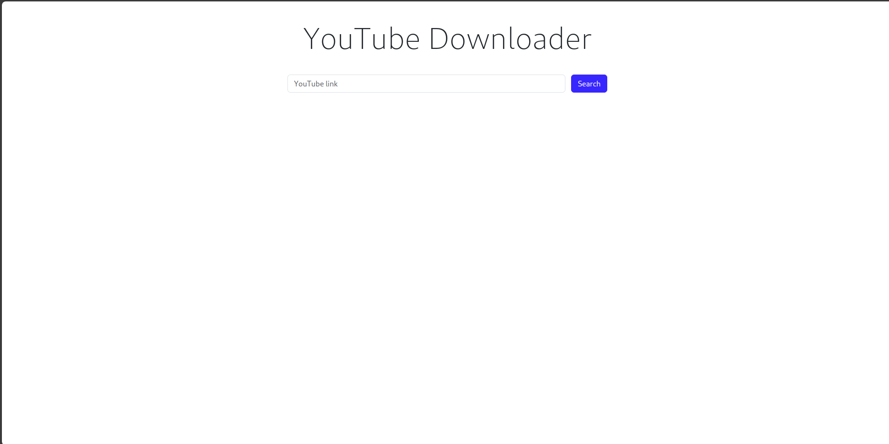
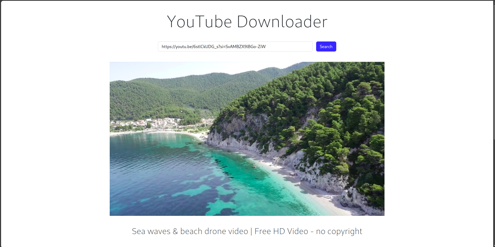
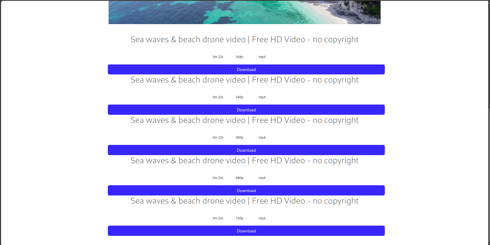
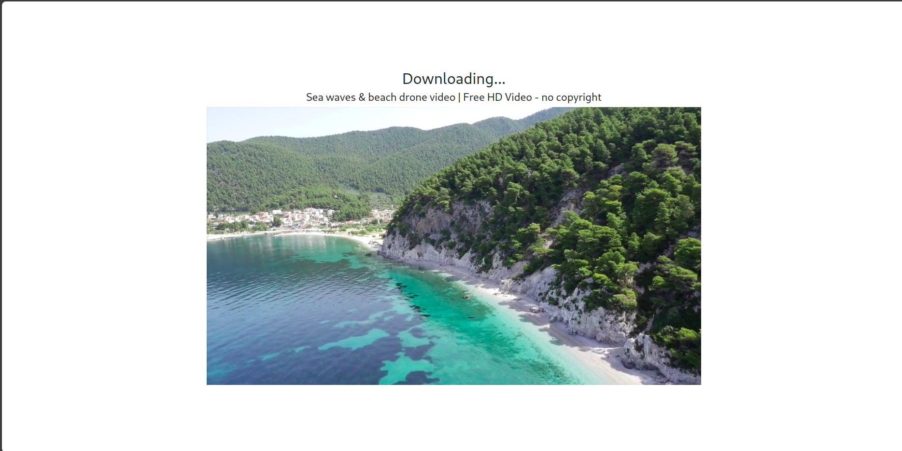

# Yt-Downloader

Simple Project built on React , nodejs as backend Server, yt-dlp for downloading module

## Features

- Download Social Media Platform Media
- Customizable for create own endpoints

## Screenshots

### Search Screen


### Search Result Screen



### Search Result List 


### Downloading Screen

## Installation

### Prerequisites
- Node.js
- npm 
- express
- React


##
### Setup Yt-dlp
Install Python        
1. Debain 
     ```bash
     sudo apt install python python-pip && pip install yt-dlp
2. Arch
     ```bash
     sudo pacman -Syu yt-dlp
### Setup Nodejs localhost
1. Clone the repository:
   ```bash
   git clone https://github.com/adityakumar-dev/Yt_Downloader
2. Navigate to Directory 
    ```bash
    cd yt-downloader 
3. Download Packages
    ```bash
    npm i
4. Start server
    ```
    npx i nodemon index.js

##
### Setup React 
1. Navigate to React Project
    ```bash
    cd yt-downloader

2. Run Project 
    ```bash
    npm i && npm run dev
## 
Thanks for visiting 
